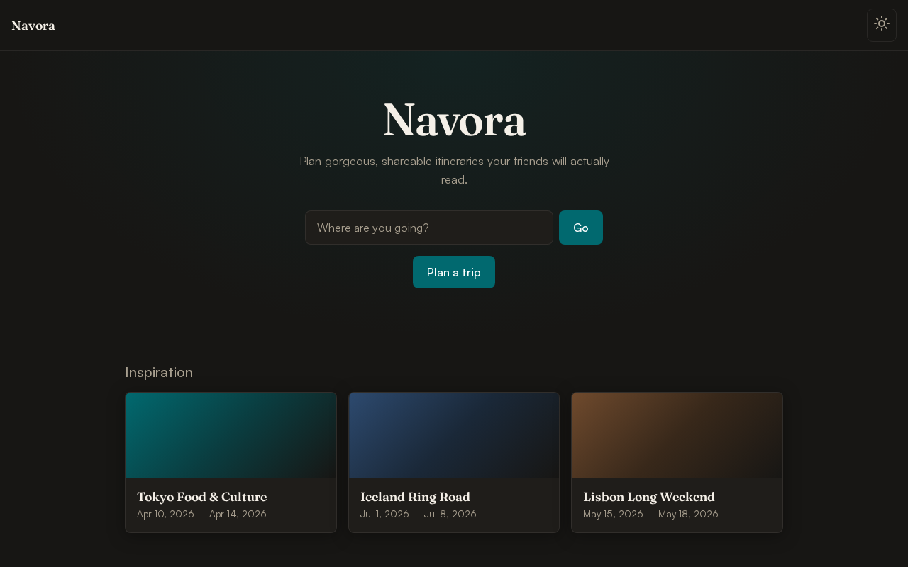
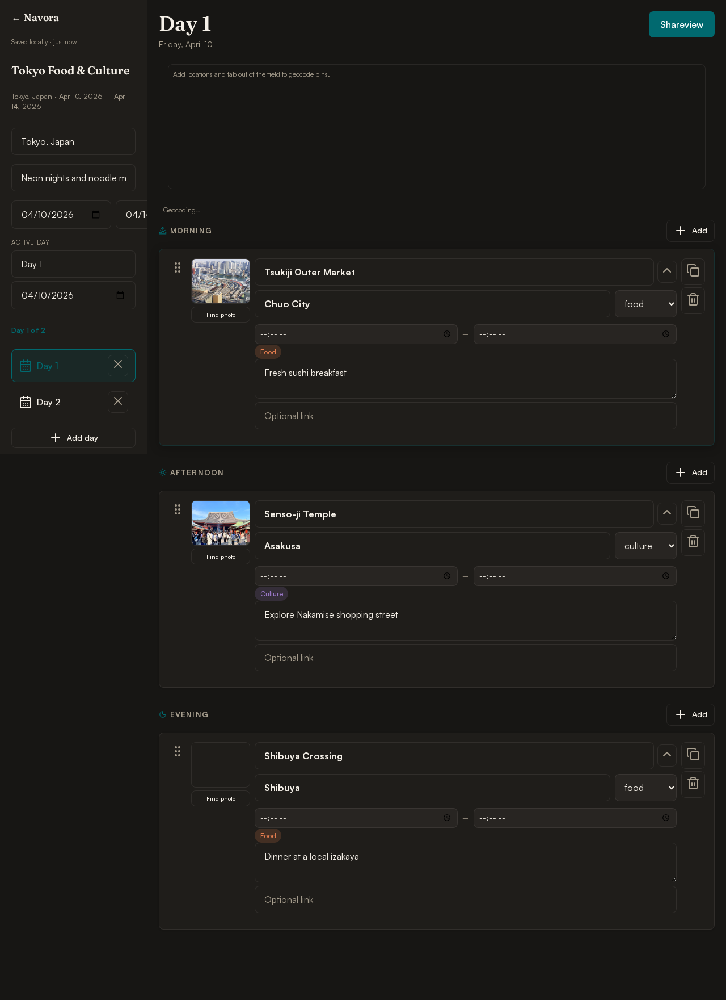
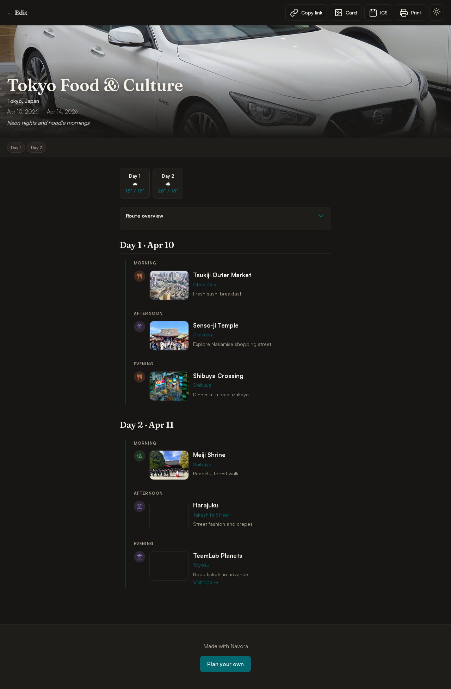
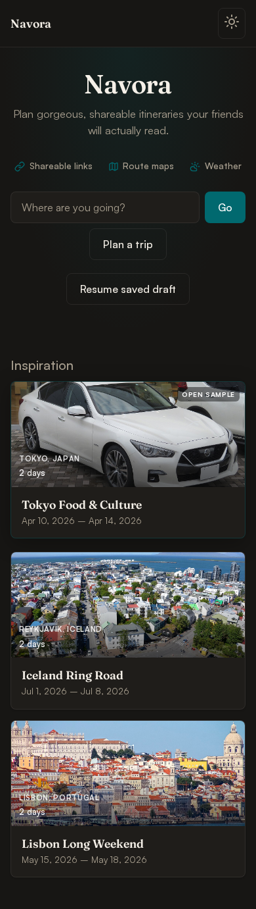

# Navora

A travel planning tool that builds gorgeous, shareable itinerary pages. Built with Vite — deploy to GitHub Pages or run locally.

**[Try Navora live](https://dpastoetter.github.io/Navora/)**

## Screenshots

Captured from the production build (`npm run build && npm run preview`, then `npm run screenshots`). The capture script dismisses the first-visit hint so home shots stay clean.

### Home

Centered hero with Share / Map / Weather highlights, destination search, and sample trips with photo overlays and “Open sample” affordances.



### Builder

Tokyo sample with activity photos, collapsible cards, geocode status, route map, autosave indicator, and sidebar insights / weather / packing.



### Shareview

Share link view with destination hero, day-jump chips, weather strip, route map, and photo timeline.



### Mobile



To regenerate screenshots after UI changes:

```bash
npm run build && npm run preview
# in another terminal:
npm run screenshots
```

## Features

- **Multi-day trip builder** — Morning, afternoon, and evening blocks; duplicate activities; collapse cards for quicker scanning
- **Draft autosave** — LocalStorage draft with a “Saved locally” timestamp in the sidebar
- **Shareable URLs** — Compressed trip in `#view?d=…` (LZ-String); size check with JSON export fallback when the link is too large
- **Shareview** — Hero, sticky day headers, jump-to-day chips, timeline, route map (auto-opens with 2+ geocoded stops), weather strip, mood themes
- **Story card PNG** — Social-ready export
- **ICS calendar export** — Timed activities → `.ics`
- **Print stylesheet** — Clean itinerary printout
- **Day templates & smart insights** — Templates + warnings with quick-fix actions
- **Interactive map** — Geocoded pins + route polyline; inline location status (pending / on map / not found)
- **Open-Meteo weather** — Forecast strip when days have dates; nudge to set dates when missing
- **Packing list** — Auto-suggestions from activity categories
- **Trip tools** — JSON import/export, duplicate, undo, localStorage draft
- **Preferences** — Theme and share-map open state remembered across visits
- **Live sync** — PeerJS room codes for co-editing
- **Embed mode** — `#view?d=…&embed=1` for minimal chrome
- **City & sight photos** — Curated Wikimedia images for sample trips; auto/Wikipedia lookup for custom stops
- **Mobile** — Tabbed days / map / share; FAB adds to morning, afternoon, or evening

## Development

```bash
npm install
npm run dev      # http://127.0.0.1:5173
npm run build    # output in dist/
npm run preview  # preview production build
npm test         # Playwright E2E + unit checks (builds & serves preview)
```

Open without npm: serve `dist/` after build, or see [`index.legacy.html`](index.legacy.html) (original single-file version).

## Routes

| Hash | Screen |
|------|--------|
| (empty) | Home |
| `#plan` | Builder |
| `#view` | Shareview |

## Keyboard shortcuts

Press `?` anywhere (outside inputs) for the in-app shortcuts panel.

| Key | Action |
|-----|--------|
| `?` | Open shortcuts help |
| `n` | New activity (last block used; default morning) |
| `1`–`9` | Switch day (builder) |
| `/` | Focus destination (home) |
| `Ctrl/Cmd+Z` | Undo (builder) |
| `Esc` | Close dialog or mobile FAB menu |

## Project structure

```
Navora/
├── index.html          # Vite entry
├── src/
│   ├── main.js
│   ├── styles/main.css
│   ├── actions.js    # UI events, share copy, shortcuts
│   ├── render.js     # Home / builder / shareview
│   ├── partial.js    # Sidebar & card DOM updates without full re-render
│   ├── prefs.js      # Theme, map, onboarding flags
│   └── …modules
├── public/images/      # Bundled destination & sight photos
├── docs/screenshots/ # README captures (npm run screenshots)
├── dist/               # GitHub Pages artifact
├── index.legacy.html   # Original monolith
└── package.json
```

## Deploy (GitHub Pages)

Push to `main` — the included workflow builds `dist/` and deploys to Pages. Set Pages source to **GitHub Actions**.

Site URL: `https://dpastoetter.github.io/Navora/`

## License

MIT — see [LICENSE](LICENSE).
